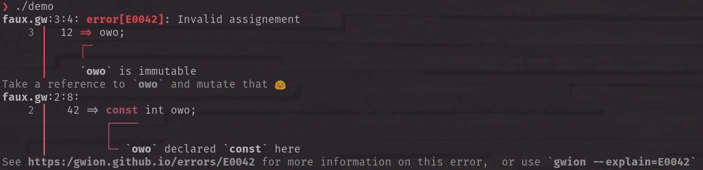

(archiving, the lib was moved to [gwion-util](https://github.com/Gwion/gwion-util)

# libprettyerr

A C library for displaying informative, clean and readable errors  

`libprettyerr` provides a simple api to nicely display error messages
for your programming language.  

Backed by [libtermcolor](https://github.com/euppal/libtermcolor),
it allows for displaying colored messages within the error.  

  

is generated by this [example file](main.c)  


## Using prettyerr in your project

Add the repo as a submodule and build it

```sh
git submodule add https://github.com/fennecdjay/libprettyerr
cd libprettyerr
make
```

Add `-Ilibprettyerr/src` to your project's `CFLAGS`  
And `-Llibprettyerr -l prettyerr` to your project's `LDFLAGS`  

You can then start using libprettyerr.  

  > If you're unsure about usage, look at the [example file](main.c)
